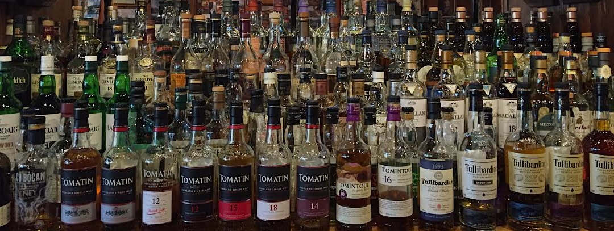

```{r echo=FALSE, include=FALSE}
library("ggplot2")
library("directlabels")
library("plyr")
library("ggthemes")
```
``
```{r echo=FALSE, out.width='100%'}

```

Earlier this month, I went to a bar in Minneapolis called "Merlin's Rest" with one of the most impressive scotch collections I've ever seen compiled in a whisky bible (see: <http://merlinsrest.com/whiskywhiskey/the-whisky-bible/>). Certain whiskies aged about 30 years ran over $200 for a single pour. This got me thinking a lot about the relationship of the age and price of whisky. 

So I did what any reasonable person did and found an API (<https://github.com/WhiskeyProject/whiskey-api>) to scrape the data and look at the relationship.

Once I gathered the data (for those interested: <https://github.com/GWarrenn/whisky/blob/master/whisky.py>), the first thing I wanted to do was to run a simple linear regression on price and age to show the relationship between the two.

```{r echo=FALSE}

whisky_data_w_years <- read.csv("whisky.csv")

y <- whisky_data_w_years$price
x <- whisky_data_w_years$year
```

The output below shows a coefficient of about 5.826, meaning that for every year you add onto a bottle of scotch, the price goes up about $5.83. 

```{r}
initial_model <- lm(y ~ x)

initial_model
```

We can then use this model as way to roughly predict what the average 15-year bottle of whisky would cost.

```{r}
predict(initial_model,data.frame(x=15),interval="confidence")
```

And here is the relationship plotted out. The data also contains an average user rating, more on that later.

```{r, fig.width=10,fig.height=10,echo=FALSE}

ggplot(whisky_data_w_years, aes(x=whisky_data_w_years$year, y=whisky_data_w_years$price),) + 
  geom_smooth(method='lm',formula=y~x) + geom_point(aes(colour=whisky_data_w_years$rating),size=3) +
  labs(caption = "Source: Whisky Project API https://github.com/WhiskeyProject/whiskey-api", 
         x = "Whisky Age (Years)", y = "Bottle Price",colour="Rating") + 
  ggtitle("Whisky Age & Price") + theme_fivethirtyeight() + 
  theme(plot.title = element_text(hjust = 0.5),axis.title = element_text()) + ylab('Bottle Price')

```

However, the r-squared for this model isn't incredibly high, indicating that something other than age is determining the price of the bottle. 

```{r}
summary(initial_model)$r.squared
```

However, once we control for the whisky's origin, we see a modest increase in the overall fit of the model. In some regions we actually see a negative coefficients, while regions like Japan have a crazy high coefficient. 
```{r}
y <- whisky_data_w_years$price
x <- whisky_data_w_years$year
r <- whisky_data_w_years$region

model_w_region <- lm(y ~ x + r)

model_w_region

summary(model_w_region)$r.squared
```

We can also use the region to predict the value of an average bottle of 15 year whisky from various parts of the world.

```{r}
predict(model_w_region,data.frame(x=15,r="Speyside"),interval="confidence")
predict(model_w_region,data.frame(x=15,r="Japan"),interval="confidence")
predict(model_w_region,data.frame(x=15,r="Highland"),interval="confidence")
```

The next step was to use the rating data that users have contributed along with the prices to segment the whiskies by average price and rating.


```{r, echo=FALSE}

whisky_data <- read.csv("whisky_all.csv")

whisky_data$mean_rating <- mean(whisky_data$rating)
whisky_data$mean_price <- mean(whisky_data$price)
whisky_data$value[whisky_data$rating>=whisky_data$mean_rating & whisky_data$price>=whisky_data$mean_price] <- "Above average rating & price" 
whisky_data$value[whisky_data$rating<whisky_data$mean_rating & whisky_data$price>=whisky_data$mean_price] <- "Below average rating & Above average price" 
whisky_data$value[whisky_data$rating>=whisky_data$mean_rating & whisky_data$price<whisky_data$mean_price] <- "Above average rating & Below average price" 
whisky_data$value[whisky_data$rating<whisky_data$mean_rating & whisky_data$price<whisky_data$mean_price] <- "Below average rating & price" 
```

Tip: Beware of the top-left and seek out the bottom right.

```{r,, fig.width=10,fig.height=10,echo=FALSE}
ggplot(whisky_data, aes(x=whisky_data$rating, y=whisky_data$price)) + 
  geom_point(aes(colour=whisky_data$value),size=3) + geom_vline(xintercept = whisky_data$mean_rating) + 
  geom_hline(yintercept = whisky_data$mean_price) +
  labs(caption = "Source: Whisky Project API https://github.com/WhiskeyProject/whiskey-api", 
       x = "Rating", y = "Bottle Price",colour="Rating") + 
  ggtitle("Whisky Rating & Price") + theme_fivethirtyeight() + 
  theme(plot.title = element_text(hjust = 0.5),axis.title = element_text()) + ylab('Bottle Price')

```

Last but not least, I wanted to find good "value" whiskies, whisky's that are on the lower end of the price spectrum but have generally higher ratings. I measured this by dividing the rating by price to create a rough "best value" measure. 

```{r,,echo=FALSE}

whisky_data <- read.csv("whisky_all.csv")

whisky_data$best_value <- whisky_data$rating/whisky_data$price

top_10 <- arrange(whisky_data,desc(best_value))

top_10 = top_10[1:10,]
```

```{r, fig.width=10,fig.height=10,echo=FALSE}
ggplot(top_10, aes(x = reorder(top_10$name, top_10$best_value), y = top_10$best_value,fill=top_10$best_value)) + 
  geom_bar(stat = "identity",show.legend=FALSE) + coord_flip() + 
  labs(caption = "Source: Whisky Project API https://github.com/WhiskeyProject/whiskey-api", 
       y = "Best Value: Rating/Price", x = "") +
  geom_text(aes(label=paste("price = $",top_10$price,sep="")), vjust=-1,hjust=-0.1, position=position_dodge(.5), size=5,) + ggtitle("Best Value Whiskies: Rating/Price") +
  geom_text(aes(label=paste("rating =",top_10$rating)), vjust=1,hjust=-0.1, position=position_dodge(.5), size=5) +  ylim(c(0,8))

```

